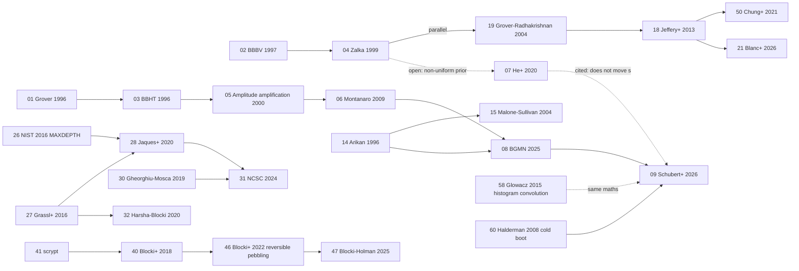

# Path 3 (Grover) literature analysis: themes, consensus and debates, research gaps

*6 Oct 2026. Covers only the **42 PDFs downloaded** into `Path_3 (Grover's)/Literature_Review/`. The 18 papers marked "manual" in `README.md` were not read (§0.3). For every paper I read the abstract, introduction, main results and conclusion or future-work section, and pulled extra sections where a claim needed checking. Numbers and quotes below come from the PDF text. Papers are cited by their folder number, e.g. **[06]** = Montanaro.*

**The three analyses:**
- **Part 1, thematic extraction and pattern mapping:** 6 themes, a paper × theme matrix and a lineage diagram.
- **Part 2, consensus and debate:** 10 points of agreement, 8 real debates, and 3 apparent contradictions that turn out not to be real.
- **Part 3, research gaps:** what was overlooked, what the authors themselves say is open, and 6 study designs that build on the gaps.

---

## 0. Scope and reading notes

### 0.1 The corpus (42 papers)

| # | Short citation | Year | What it contributes |
|---|---|---|---|
| 01 | Grover | 1996 | O(√N) quantum search |
| 02 | Bennett, Bernstein, Brassard, Vazirani (BBBV) | 1997 | Ω(√N) lower bound; NP is not in o(2^(n/2)) relative to a random oracle |
| 03 | Boyer, Brassard, Høyer, Tapp (BBHT) | 1996 | Exact success curve; unknown number of solutions; approximate counting |
| 04 | Zalka | 1999 | Grover is *exactly* optimal; parallel search is no better than splitting the space |
| 05 | Brassard, Høyer, Mosca, Tapp | 2000 | Amplitude amplification from any start state A; amplitude estimation |
| 06 | Montanaro | 2009 | Search with advice: expected cost Σ pᵢ√i, optimal up to constants |
| 07 | He, Zhang, Sun | 2020 (Sci. China Inf. Sci. 2024) | Optimal success probability with exactly T queries under a prior |
| 08 | Glaser, May, Nowakowski (published as Bashiri, Glaser, May, Nowakowski, EUROCRYPT 2026), "BGMN" | 2025 | Arikan ⇒ s ≥ 2·H½/H⅔ > 2; Kyber, LPN, Zipf passwords; multi-key cost uses Shannon entropy |
| 09 | Schubert, Paskarbeit, Kramer, Seifert, Margraf | 2026 | Exact, certified exponent s for product priors; up to 3.97 |
| 12 | Hanson, Katariya, Datta, Wilde | 2020 | Guesswork with quantum side information |
| 14 | Arikan | 1996 | Guessing moments ↔ Rényi entropy |
| 15 | Malone, Sullivan | 2004 | Guesswork moments of Markov sources (Perron–Frobenius) |
| 16 | Bonneau | 2012 | 70M Yahoo passwords; α-guesswork; why entropy is the wrong metric |
| 18 | Jeffery, Magniez, de Wolf | 2013 | Tight p-parallel quantum query bounds |
| 19 | Grover, Radhakrishnan | 2004 | Parallel-query search for several items |
| 21 | Blanc, Docter, Strassle, Tan | 2026 | t-query, d-round quantum algorithms can be simulated classically with t^O(d²) queries on most inputs |
| 22 | Babbush et al. (Google) | 2021 | Quadratic speedups do not survive fault-tolerance overheads; quartic ones might |
| 23 | Cade, Folkertsma, Niesen, Weggemans | 2023 | Grover costs with all constants; empirical runtime estimates |
| 26 | NIST PQC Call for Proposals | 2016 | MAXDEPTH 2⁴⁰–2⁹⁶; AES-based security categories |
| 27 | Grassl, Langenberg, Roetteler, Steinwandt | 2016 | First full AES Grover circuits (qubit-minimised) |
| 28 | Jaques, Naehrig, Roetteler, Virdia | 2020 | Depth-optimised AES/LowMC oracles under MAXDEPTH (Q#) |
| 29 | Amy et al. | 2016 | Surface-code cost of SHA-256/SHA3-256 preimage search |
| 30 | Gheorghiu, Mosca | 2019 | Physical cost benchmarks: AES, SHA, Bitcoin, RSA, ECC |
| 31 | UK NCSC | 2024 | Practical, parallelised, error-corrected cost of Grover on AES |
| 32 | Harsha, Blocki | 2020 | Economic model of quantum key recovery ("cipher circuit years") |
| 39 | Melicher et al. | 2016 | Neural-network password models |
| 40 | Blocki, Harsha, Zhou | 2018 | Economics of offline password cracking; Zipf law; rational attacker |
| 41 | Percival | 2009 | scrypt, sequential memory-hard functions |
| 42 | Biryukov, Dinu, Khovratovich | 2016 | Argon2 (d/i/id) |
| 43 | Provos, Mazières | 1999 | bcrypt: adaptable cost |
| 46 | Blocki, Holman, Lee | 2022 | Parallel *reversible* pebbling: post-quantum cost of iMHFs |
| 47 | Blocki, Holman | 2025/26 | Data-dependent MHFs: sustained-space vs CMC trade-offs in the PROM |
| 50 | Chung, Fehr, Huang, Liao | 2021 | Compressed oracle with parallel queries; hash chains are quantum-sequential |
| 51 | Beame, Kornerup | 2023 | First cumulative-memory lower bounds for quantum circuits |
| 52 | Giovannetti, Lloyd, Maccone | 2008 | Bucket-brigade QRAM |
| 53 | Jaques, Rattew | 2025 | QRAM survey and critique |
| 54 | Grover, Rudolph | 2002 | State preparation for efficiently integrable distributions |
| 55 | Babbush et al. | 2018 | QROM and linear-T state preparation (alias sampling) |
| 56 | Low, Kliuchnikov, Schaeffer | 2024 | Trading T gates for dirty qubits (QROAM) |
| 57 | Veyrat-Charvillon, Gérard, Renauld, Standaert | 2012 | Optimal key enumeration from side-channel probabilities |
| 58 | Glowacz, Grosso, Poussier, Schüth, Standaert | 2015 | Rank estimation by histogram convolution |
| 60 | Halderman et al. | 2008 | Cold-boot attacks; decay model; key-schedule error correction |

### 0.2 Metadata facts found while reading (update the other notes)

1. **"Bashiri 2025" [08] is the GMN paper.** The PDF is arXiv 2509.06549 by Glaser, May and Nowakowski. Schubert et al. [09] cite the published version as *Bashiri, Glaser, May, Nowakowski, EUROCRYPT 2026, pp. 457–480*. So "Bashiri et al." and "GMN" are one paper. This settles the "unresolved reference" in `Grover_Research_Gaps.md` §8. This file calls it **BGMN**.
2. **He–Zhang–Sun [07] was published** in *Science China Information Sciences* 67(9), 192503 (2024), per Schubert's reference [20]. That answers the week-1 question in `Grover_Research_Gaps.md` §8.
3. **BGMN [08] does not cite He–Zhang–Sun or Zalka** (searched the arXiv text). Schubert [09] does cite He et al., but says fixed-budget variants "do not move s".
4. **Gheorghiu–Mosca 2019 [30] has no PBKDF2 or password rows** (searched the text). Its symmetric results cover AES, SHA-256, SHA3-256 and Bitcoin. The NAP Table 4.1 PBKDF2 figure must come from a different Mosca–Gheorghiu report, so the README's note for #30 is inaccurate.

### 0.3 Not in this analysis (not downloaded)

These were excluded: #10 Martin et al. 2017, #11 Dürmuth et al. 2021, #13 Göpfert 2017, #17 Wang (Zipf) 2017, #20 Bindel et al. 2023, #24 Fluhrer 2017, #25 Jaques–Schanck 2019, #33 SHA-1 2025, #34 JRC Keccak 2026, #35 NAP 2019, #36 Weir PCFG, #37 OMEN, #38 Dell'Amico Monte Carlo, #44–45 Alwen et al., #48–49 Song et al. (Argon2/scrypt circuits), #59 ASCAD.

**#10 and #11 matter most.** Wherever a conclusion would depend on them, I say so.

---

# PART 1: Thematic extraction and pattern mapping

## 1.0 Overview

| Theme | Core question | Papers |
|---|---|---|
| **T1** The quadratic ceiling | How fast can quantum search be, and does parallelism help? | 01, 02, 03, 04, 05, 18, 19, 21, 50 |
| **T2** Search with prior knowledge | How much does a known non-uniform distribution help a quantum guesser? | 04, 05, 06, 07, 08, 09, 12 |
| **T3** Measuring guessability | Which number says how hard a secret is to guess? | 08, 09, 12, 14, 15, 16, 39, 40, 57, 58 |
| **T4** The real price of Grover | What does Grover cost once oracles, depth limits, error correction and money are counted? | 22, 23, 26, 27, 28, 29, 30, 31, 32 |
| **T5** Password hashing and memory-hardness | How do slow or memory-hard hashes resist guessing, classically and quantumly? | 16, 39, 40, 41, 42, 43, 46, 47, 50, 51 |
| **T6** From side information to a quantum prior | How is leakage turned into ranked candidates, and how is a prior loaded into a quantum state? | 05, 07, 08, 09, 52, 53, 54, 55, 56, 57, 58, 60 |

### Paper × theme matrix (● = central, ○ = touches)

| Paper | T1 | T2 | T3 | T4 | T5 | T6 |
|---|---|---|---|---|---|---|
| 01 Grover 1996 | ● | | | | | |
| 02 BBBV 1997 | ● | | | | | |
| 03 BBHT 1996 | ● | | | ○ | | |
| 04 Zalka 1999 | ● | ○ | | | | |
| 05 Brassard+ 2000 | ● | ● | | | | ○ |
| 06 Montanaro 2009 | | ● | ○ | | | |
| 07 He+ 2020 | | ● | ○ | | | ○ |
| 08 BGMN 2025 | | ● | ● | | ○ | ○ |
| 09 Schubert+ 2026 | | ● | ● | | | ● |
| 12 Hanson+ 2020 | | ○ | ● | | | |
| 14 Arikan 1996 | | ○ | ● | | | |
| 15 Malone–Sullivan 2004 | | | ● | | | |
| 16 Bonneau 2012 | | | ● | | ● | |
| 18 Jeffery+ 2013 | ● | | | ○ | | |
| 19 Grover–Radhakrishnan 2004 | ● | | | | | |
| 21 Blanc+ 2026 | ● | ○ | | ○ | | |
| 22 Babbush+ 2021 | | | | ● | | |
| 23 Cade+ 2023 | ○ | | | ● | | |
| 26 NIST 2016 | | | | ● | | |
| 27 Grassl+ 2016 | | | | ● | | |
| 28 Jaques+ 2020 | | | | ● | | |
| 29 Amy+ 2016 | | | | ● | ○ | |
| 30 Gheorghiu–Mosca 2019 | | | | ● | | |
| 31 NCSC 2024 | ○ | | | ● | | |
| 32 Harsha–Blocki 2020 | ○ | | | ● | ○ | |
| 39 Melicher+ 2016 | | | ○ | | ● | |
| 40 Blocki+ 2018 | | | ● | ○ | ● | |
| 41 Percival 2009 | | | | | ● | |
| 42 Biryukov+ 2016 | | | | | ● | |
| 43 Provos–Mazières 1999 | | | | | ● | |
| 46 Blocki+ 2022 | | | | ○ | ● | |
| 47 Blocki–Holman 2025 | | | | | ● | |
| 50 Chung+ 2021 | ● | | | | ● | |
| 51 Beame–Kornerup 2023 | | | | | ● | |
| 52 Giovannetti+ 2008 | | | | | | ● |
| 53 Jaques–Rattew 2025 | | | | ○ | | ● |
| 54 Grover–Rudolph 2002 | | | | | | ● |
| 55 Babbush+ 2018 | | | | | | ● |
| 56 Low+ 2024 | | | | | | ● |
| 57 Veyrat-Charvillon+ 2012 | | | ● | | | ● |
| 58 Glowacz+ 2015 | | | ● | | | ● |
| 60 Halderman+ 2008 | | | | | | ● |

**Pattern visible in the matrix:**
- No paper is central to both **T2** (priors) and **T4** (real cost).
- No paper is central to both **T2** and **T5** (password hashing).
- The prior-search line and the cost-of-Grover line have developed separately. Part 3 builds on this.

### Lineage (who builds on whom, inside the corpus)

The dashed links are the weakest. The prior-search line (06 → 08 → 09) has **no edge** to the cost line (26 → 28 → 31) or to the hashing line (41 → 40 → 46).

---

## T1. The quadratic ceiling: optimality and (non-)parallelisability of unstructured search

**Core concept**
- For a black-box predicate over N items, any quantum algorithm needs Θ(√N) oracle queries.
- The constant is pinned exactly (≈ π/4·√N).
- Spreading the work over p machines only gives √(N/p) per machine. It is the same as splitting the search space, so no extra quantum gain comes from parallelism.

**Studies:** Grover [01]; BBBV [02]; BBHT [03]; Zalka [04]; Brassard–Høyer–Mosca–Tapp [05]; Jeffery–Magniez–de Wolf [18]; Grover–Radhakrishnan [19]; Chung–Fehr–Huang–Liao [50]; Blanc–Docter–Strassle–Tan [21]. Applied by NCSC [31] and Harsha–Blocki [32].

**What the collective evidence says**
- **Upper bound.** Grover finds one marked item in O(√N) steps "within a small constant factor of the fastest possible" [01].
- **Exact success curve.** BBHT [03] give success sin²((2m+1)θ) with sin²θ = t/N, so the optimal number of iterations is ≈ π/4·√(N/t).
  - Over-iterating is harmful: "if we work twice as hard … we achieve a negligible probability of success" [03].
  - They also handle an unknown number of solutions t, still in O(√(N/t)), and introduce approximate counting.
- **Lower bound.**
  - BBBV [02]: relative to a random oracle, NP is not in quantum time o(2^(n/2)); relative to a random permutation oracle, NP∩coNP is not in o(2^(n/3)). There is "no black-box approach" to NP-complete problems.
  - Zalka [04] makes it **exact**: for any number of queries up to ≈ π/4·√N, Grover gives the maximal success probability, even with intermediate measurements.
  - Zalka also notes that stopping early and restarting cuts the *average* number of queries by 12.14%.
- **Generalisation.** Amplitude amplification [05] boosts any algorithm A with success probability a to O(1/√a) uses of A and A⁻¹, with or without knowing a. This is the template for every prior-based search in T2.
  - The authors add: "we do not believe that a super-quadratic quantum improvement for a non-promise black-box problem is possible" [05].
- **Parallelism gives nothing extra.**
  - Zalka [04]: S machines running T steps can search only O(S·T²) items. Splitting the space is optimal.
  - Grover–Radhakrishnan [19]: for k items and d parallel database copies, Θ(√(Nk/(d·min{d,k}))) parallel queries, tight up to O(log d).
  - Jeffery et al. [18]: p-parallel search costs Θ(√(n/p)), and element distinctness costs Θ((n/p)^(2/3)). Their motivation is decoherence.
  - Chung et al. [50] re-derive parallel-Grover optimality with the compressed oracle: k parallel queries for q rounds give success O(kq²/2^m). They also prove parallel BHT collision search optimal, and show a q-step hash chain needs q sequential rounds.
- **Depth and speedups.** Blanc et al. [21]:
  - Every t-query, d-round quantum algorithm can be simulated classically with 2^O(d²)·poly(t)^O(d) queries on most inputs (improved to t^O(d) in their final note).
  - So superpolynomial speedups on unstructured problems need superconstant depth, and exponential ones need polynomial depth.
- **Applied consequence.**
  - "Reducing the depth by a factor of S … requires S² parallel instances" [31].
  - k parallel circuits multiply total work by k [32].

**Summary:** for uniform or worst-case search, the quadratic ceiling and the parallel penalty are the most settled results in the corpus. Nothing in the 42 papers challenges them.

---

## T2. Search with prior knowledge and "super-quadratic" speedups

**Core concept**
- If the secret follows a known distribution p₁ ≥ p₂ ≥ …, the best classical attacker guesses in that order, with expected cost E[G] = Σ i·pᵢ.
- A quantum attacker (Montanaro) pays about E[√G] = Σ √i·pᵢ.
- The speedup exponent is s = log E[G] / log E[√G]. Jensen's inequality gives s ≥ 2, with equality only for the uniform case.
- "Super-quadratic" means s > 2. It is a statement about **expected cost with success probability 1 on one sequential machine**.

**Studies:** Zalka [04] (posed it as open); Brassard et al. [05] (mechanism); Montanaro [06]; He–Zhang–Sun [07]; BGMN [08]; Schubert et al. [09]; Hanson et al. [12] (information-theoretic side).

**What the collective evidence says**
- **The problem was open in 1999.** Zalka's final remarks: extending optimality to "a non-uniform a priori probability … seems plausible … then one also has to consider a modified Grover algorithm" [04].
- **Montanaro [06], expected-cost optimal algorithm.**
  - Run Grover on blocks of the sorted list whose sizes grow geometrically. Expected queries are Θ(Σ pₓ√x), optimal up to constants.
  - It only needs the *ordering* of probabilities.
  - For some power-law priors it gives exponential or super-exponential average-case separations (O(1) quantum vs polynomially many classical expected queries).
  - The model is zero-error: a "valid" algorithm must output x with certainty.
  - An "unknown model" variant draws quantum samples of the prior.
- **He–Zhang–Sun [07], fixed-budget optimal algorithm.**
  - For exactly T queries they replace Grover's initial state and diffusion with prior-dependent operations, and prove the expected success probability is **maximal**.
  - "The quantum advantage … increases as the distribution … becomes more biased."
  - They criticise Montanaro's Las Vegas analysis for time-limited tasks: "an algorithm with asymptotically optimal running time is not good enough for time-sensitive tasks".
  - They note that circuit fidelity falls as the number of queries grows.
  - Demo: a one-query, 3-qubit run on IBM's 5-qubit ibmqx2.
- **BGMN [08], tight analysis through Arikan's inequality.**
  - T_C ≈ 2^H½ classically and T_Q ≈ 2^(H⅔/2) quantumly, so s ≥ 2·H½/H⅔·(1−o(1)) > 2 for every non-uniform prior.
  - Reported cases: Kyber's binomial and a Zipf password model (LinkedIn, Z(1.6·10⁸, 0.777)) give s > 2.04; Bernoulli(0.1) (LPN) gives s > 2.27; small-error LPN gives an unbounded s = Ω(n^(1/12)).
  - **Multi-key:** recovering a constant fraction c < ½ of m keys costs 2^(H(χ)n) per key classically and 2^(H(χ)n/2) quantumly (Shannon entropy). That is quadratic. The algorithm "aborts key guessing after a certain number of guesses", which is a budget.
  - It assumes black-box access to GetKey (the i-th likeliest key). Already used in a lattice hybrid attack [KKNM25].
- **Schubert et al. [09], exact, certified exponents.**
  - For product priors: rank is set by surprisal, surprisals convolve over coordinates, and exponential tilting keeps the computation stable. A binning error certificate covers non-commensurate cases.
  - Results (their Table 2, against BGMN's bound in brackets):
    - Cold boot (asymmetric decay, reverse flips 0.001), AES-128 / 128-bit seed: **3.918** (2.310) at decay 0.01; **2.763** (2.187) at 0.05; **2.199** (1.975) at 0.25.
    - Cold boot, AES-256: **3.639** at 0.01; **2.713** at 0.05; **2.245** at 0.20.
    - PRESENT-80: **2.819** at 0.05; **2.263** at 0.20.
    - Synthetic Bernoulli fitted to Keccak SASCA residual ranks: ML-KEM coin **3.114** (rank 2⁶⁹) and **2.513** (rank 2¹²⁸); ML-DSA **3.974** (rank 2⁶⁹) and **3.179** (rank 2¹²⁸).
    - AES template attack: **2.018** (SNR 1) and **2.032** (SNR 5), "the instructive negative".
  - In five rows BGMN's bound falls below 2 and "certifies nothing at all".
  - Their conclusion: "it is the shape of the advice, more than the strength of the leakage, that decides whether Montanaro's algorithm is worth deploying."
- **Information-theoretic side.** Hanson et al. [12]: with quantum side information, any sequential guessing strategy equals one measurement followed by a classical guessing order. Guesswork becomes an SDP, and asymptotically should equal a conditional Rényi-½ entropy (conjectured).

**Summary:**
- Agreed: for any non-uniform prior, the expected-cost exponent is above 2. Its size ranges from ≈2.02 (smooth 256-ary template posteriors) to ≈4 (strongly skewed bit posteriors).
- **Every algorithmic paper in this theme makes the same assumptions:**
  - one sequential machine;
  - no depth or wall-clock limit;
  - unit-cost oracle;
  - the loader is ignored or treated as a black box.

---

## T3. Measuring guessability: entropy, guesswork moments, partial guessing

**Core concept:** which single number, or curve, should describe how hard a non-uniform secret is to guess? There are two traditions:
- **information theory:** guesswork moments E[G^ρ] tied to Rényi entropies;
- **security engineering:** success at a budget (rank curves, α-guesswork, β-success).

**Studies:** Arikan [14]; Malone–Sullivan [15]; Bonneau [16]; Hanson et al. [12]; BGMN [08]; Schubert et al. [09]; Blocki–Harsha–Zhou [40]; Melicher et al. [39]; Veyrat-Charvillon et al. [57]; Glowacz et al. [58].

**What the collective evidence says**
- **Moments ↔ Rényi.**
  - Arikan [14] bounds E[G^ρ] within a factor (1+ln M)^ρ by the Rényi entropy of order 1/(1+ρ). This gives Rényi entropy an operational meaning (first applied to sequential decoding).
  - Malone–Sullivan [15] extend it to Markov sources: the moments' growth rate is set by the Perron–Frobenius eigenvalue of the matrix with entries p_ij^(1/(1+ρ)). They warn, citing Pliam, that guesswork "may not always be a good measure of 'guessability'".
- **Shannon entropy is the wrong number.**
  - Bonneau [16]: Shannon and guessing entropy "don't model realistic attackers and aren't approximable using sampled data". There is an *unbounded* gap between them and partial-guessing metrics (results of Pliam, Boztaş, Bonneau).
  - BGMN [08]: Arikan's result is "widely unknown in the cryptographic community". Bernstein overestimates key-guessing cost by using |K|; MATZOV underestimates it by using Shannon entropy.
- **Empirical passwords** [16, 40, 39]:
  - 70M Yahoo passwords give < 10 bits against an online trawling attack and ≈ 20 bits against an optimal offline attack.
  - Every demographic subgroup is comparably weak; population-specific dictionaries gain ≤ 2× [16].
  - Breach data follow a Zipf law [40].
  - Neural models beat PCFG and Markov guessers, especially beyond 10¹⁰ guesses, and compress to hundreds of KB [39].
- **Evaluation labs already use the budget view.** Side-channel evaluations report key rank and guessing entropy.
  - Veyrat-Charvillon et al. [57]: optimal (decreasing-probability) enumeration is practical up to ≈ 2⁴⁰ keys.
  - Glowacz et al. [58]: the rank of a 128- or 256-bit key is estimated to < 1 bit in seconds by **convolving histograms of log-probabilities**, the same idea Schubert [09] uses for surprisals.

**Summary (the main pattern of this theme):**
- The quantum papers ([06, 08, 09]) use the **moment** tradition.
- The applied, empirical work ([16, 40, 57, 58]) uses the **budget/rank** tradition.
- No paper in the corpus carries the budget view into the quantum setting, except He et al. [07] in the abstract, with no cryptographic cases.

---

## T4. The real price of Grover: oracle circuits, depth limits, fault tolerance and economics

**Core concept:**
- The query count √N is only a starting point.
- Real cost needs four more things:
  - the oracle as a reversible circuit (qubits, T-count, depth);
  - a depth limit (MAXDEPTH), which forces parallel instances and so the S² penalty;
  - error-correction overhead (physical qubits, surface-code cycles);
  - an economic or time-value view.

**Studies:** NIST [26]; Grassl et al. [27]; Jaques et al. [28]; Amy et al. [29]; Gheorghiu–Mosca [30]; NCSC [31]; Harsha–Blocki [32]; Babbush et al. [22]; Cade et al. [23].

**What the collective evidence says**
- **NIST [26] framing:**
  - MAXDEPTH ranges from 2⁴⁰ ("approximately the number of gates … presently envisioned quantum computing architectures are expected to serially perform in a year") to 2⁶⁴ to 2⁹⁶.
  - AES-128 key search costs 2¹⁷⁰/MAXDEPTH quantum gates.
  - A quantum gate may cost "billions or trillions" of classical gates, but the gap may narrow.
- **Oracle circuits.**
  - Grassl et al. [27]: about 3,000–7,000 logical qubits; much of the cost comes from the key expansion; "it seems prudent to move away from 128-bit keys".
  - Jaques et al. [28] optimise for depth and ship Q# code. At MAXDEPTH 2⁴⁰ the AES-128 G-cost is ≈ 1.07·2¹¹⁷, against NIST's 2¹³⁰ (roughly 2¹⁵⁷/MAXDEPTH instead of 2¹⁷⁰/MAXDEPTH).
- **Error-corrected cost.**
  - Amy et al. [29]: SHA-256 preimage search needs ≈ 2¹⁵³·⁸ surface-code cycles and 2¹²·⁶ logical qubits, 2¹⁶⁶·⁴ in total. That is "as much as 275 billion times more expensive than one would expect from the simple query analysis".
  - Gheorghiu–Mosca [30], quantum security parameter at physical error rate 10⁻⁴: AES-128 **106**, AES-192 139, AES-256 172, SHA-256 166, SHA3-256 167, Bitcoin PoW 75.
- **Parallel and error-corrected together, NCSC [31]:**
  - MAXDEPTH 2⁴⁸ is 8.92 years at a 1 µs cycle; 2⁶⁴ is 585,000 years.
  - AES-128 at depth 2⁴⁰ needs 2⁶⁶·³ parallel instances, 2⁷⁸·¹ logical qubits and 2¹¹⁸·¹ logical-qubit-cycles.
  - Realistic depths give costs "only 10–20 bits below the classical security levels" with "unrealistic numbers of logical qubits".
  - Verdict: "even for AES-128, the practical security impact of Grover … is limited".
- **Economics, Harsha–Blocki [32]:**
  - Even in the attacker's best case ("quantum mania", 100-year deadline) AES-128 recovery costs ≈ $9.81·10¹⁰. A 10-year deadline costs ≥ $3.35·10¹⁶.
  - "doubling key length is usually unnecessary". Their figures are lower bounds that ignore error correction.
- **Quadratic speedups rarely pay off.**
  - Babbush et al. [22]: a surface-code Toffoli takes > 10 qubit-seconds, a CMOS NAND < 10⁻⁹ transistor-seconds (about 10 orders of magnitude).
  - In their example, a quadratic speedup needs **880 millennia** to break even, a quartic one **4.9 hours**.
  - Classical parallelism makes it worse.
  - Cade et al. [23]: with all constants counted, quantum hill-climbers for MAX-k-SAT scale better, but only one reached an absolute query speedup at tested sizes.

**Summary:** all nine papers agree that real Grover cost is far above the query count. Depth limits impose a quadratic parallel penalty, and error correction eats most of the remaining margin. **Every one of them assumes a uniformly random key (the ideal-cipher model).**

---

## T5. Password hashing and memory-hardness, classical and quantum

**Core concept:**
- Human secrets are low-entropy, so defenders make each guess expensive: in time (iterations), in memory (memory-hard functions), or both.
- A quantum attacker must evaluate the hash **reversibly and in superposition**. That changes the cost model (no deletion, uncomputation, qubit memory).

**Studies:** Provos–Mazières [43]; Percival [41]; Biryukov et al. [42]; Blocki–Harsha–Zhou [40]; Bonneau [16]; Melicher et al. [39]; Blocki–Holman–Lee [46]; Blocki–Holman [47]; Chung et al. [50]; Beame–Kornerup [51].

**What the collective evidence says**
- **Classical design line.**
  - Provos–Mazières [43]: user password entropy "does not scale at all with computing power", so hashing cost must rise with hardware. This led to bcrypt.
  - Percival [41]: sequential memory-hard functions resist custom hardware; scrypt (ROMix is provably sequential memory-hard in the random oracle model). He cites an average password entropy of 42.02 bits even at paypal.com.
  - Biryukov et al. [42]: Argon2. Argon2d (data-dependent, faster, side-channel risk) vs Argon2i (data-independent, "preferred for password hashing").
- **Iteration alone is not enough.**
  - Bonneau [16]: "no practical amount of iterated hashing can prevent an adversary from breaking a large number of accounts given the opportunity for offline search".
  - Blocki et al. [40]: even LastPass's PBKDF2-SHA256 with 10⁵ iterations is insufficient. A rational attacker cracks every Zipf-distributed password. MHFs make the attacker "give up well before he cracks most user passwords". They recommend disallowing bcrypt and PBKDF2.
- **Quantum side (models, not end-to-end costs).**
  - Blocki–Holman–Lee [46]: a classical pebbling does not give a quantum circuit (No-Deletion theorem), so they define *parallel reversible pebbling*.
    - Line graph: O(N^(1+√(2/log N))).
    - Argon2i-A, Argon2i-B and DRSample all admit sub-quadratic reversible space-time attacks; DRSample O(N²·log log N/log N).
    - Gap with the classical lower bounds Ω(N^1.66) and Ω̃(N^1.75) is "an interesting open research challenge".
  - Blocki–Holman [47]: first sustained-space / CMC trade-off for a *data-dependent* MHF directly in the parallel random oracle model: sustain Ω(N) memory for Ω(N) steps, or pay CMC ≥ Ω(N^(2.5−ε)). **Purely classical: the word "quantum" never appears.**
  - Chung et al. [50]: a q-step hash chain needs q sequential parallel-query rounds even quantumly. Sequential hashing cannot be shortcut by quantum parallelism; Simple Proofs of Sequential Work are post-quantum secure.
  - Beame–Kornerup [51]: first cumulative-memory lower bounds for quantum circuits (sorting Ω(n³/T); k disjoint collisions Ω(k³n/T²)). The measure was introduced for password hashing, but no MHF bound is proved.

**Summary:**
- Classically there is consensus: memory-hard, expensive hashing is required.
- Quantumly there are tools (reversible pebbling, the compressed oracle, cumulative-memory bounds) and one proven property (sequentiality survives).
- **No paper here gives an end-to-end quantum cost for bcrypt, scrypt, Argon2d/id or PBKDF2 under a depth limit.** (The scrypt/Argon2 circuits #48–49 and NAP #35 are outside the corpus.)

---

## T6. From side information to a quantum prior: leakage, enumeration, and loading

**Core concept:**
- A prior has to come from somewhere (side-channel leakage, cold-boot decay, password models).
- Classically it is consumed by an enumerator that outputs candidates in likelihood order.
- A quantum attacker needs a **coherent** version: a circuit A that prepares Σ√qₓ|x⟩. Amplitude amplification runs A and A† in **every** iteration [05], so the loader's cost multiplies the number of iterations.

**Studies:** Veyrat-Charvillon et al. [57]; Glowacz et al. [58]; Halderman et al. [60]; Schubert et al. [09]; BGMN [08]; He et al. [07]; Brassard et al. [05]; Grover–Rudolph [54]; Babbush et al. [55]; Low et al. [56]; Giovannetti et al. [52]; Jaques–Rattew [53].

**What the collective evidence says**
- **Classical side (mature).**
  - Veyrat-Charvillon et al. [57]: Bayesian extraction of subkey probabilities, then a deterministic order-optimal enumerator with modest memory, practical to ≈ 2⁴⁰ keys. It "trade[s] side-channel measurements for offline computations".
  - Glowacz et al. [58]: rank estimation to < 1 bit in seconds, scaling to 1024-bit keys.
- **Where priors come from.** Halderman et al. [60]:
  - DRAM decays towards a known ground state; reverse flips are < 0.1%. This is the binary asymmetric channel Schubert uses, with reverse-flip rate 0.001.
  - The **AES key schedule acts as an error-correcting code**: about 15% decay is corrected "in a fraction of a second", and about half of keys with 30% decay within 30 s.
- **How the quantum papers get their ordering.**
  - BGMN [08] assume black-box GetKey (a classical Budroni–Mårtensson algorithm).
  - Schubert [09] assume Martin et al.'s coherent method (#10, outside corpus).
  - He et al. [07] sketch a circuit (their Fig. 4): compute the distribution into ancillas, rotate, then uncompute. It is not costed.
- **Generic quantum loaders.**
  - Grover–Rudolph [54]: qubit-by-qubit conditional rotations for efficiently integrable (e.g. log-concave) distributions.
  - Babbush et al. [55]: QROM with T-count linear in table length, and alias-sampling state preparation.
  - Low et al. [56]: an arbitrary N-amplitude state with O(N/λ + λ·log N·…) T gates using λ dirty qubits. Provably optimal, and at best a quadratic (≈ √N) T-count saving.
- **QRAM feasibility is contested.**
  - Giovannetti et al. [52]: bucket brigade, only O(log N) switches per access.
  - Jaques–Rattew [53]: active QRAM costs gates ∝ memory size per access, and repurposing that hardware classically erases most advantage. Every non-circuit proposal "falls short in one aspect or another"; "cheap, asymptotically scalable passive QRAM is unlikely".

**Summary:**
- The classical side turns leakage into ranked candidates cheaply.
- The quantum side only has generic loaders whose cost grows with table size (N or √N T gates), or disputed QRAM.
- **No paper prices the loader for a real password or leakage prior inside a Grover iteration.**

---

# PART 2: Consensus and debate

## 2.1 Major points of agreement

| # | Agreement | Papers that reach it independently | Strength |
|---|---|---|---|
| **C1** | For black-box unstructured search, Θ(√N) queries is optimal, with the constant pinned (≈ π/4·√N) | 01, 02, 03, 04, 05; re-proved in 50; used as fact in 26–32 | Settled (proofs) |
| **C2** | Parallelism gives only √p: splitting the search space is optimal, so reducing depth by S costs S² instances | 04, 18, 19, 50 (proofs); 26, 28, 31, 32 (applied) | Settled |
| **C3** | The optimal classical guesser tries candidates in decreasing probability, and its expected cost is governed by Rényi-½ entropy, not Shannon entropy | 14, 15, 08, 09, 57; Bonneau's critique [16]; Hanson [12] | Settled |
| **C4** | With a non-uniform prior, quantum search beats plain Grover, and the expected-cost exponent is ≥ 2, strictly > 2 when non-uniform. The gain grows with skew | 06, 07, 08, 09 | Settled for expected cost |
| **C5** | Shannon entropy and single-number guessing entropy mislead as security metrics | 16, 08 (vs MATZOV), 15 (citing Pliam), 12, 09 (citing Massey) | Strong |
| **C6** | The query count badly underestimates real Grover cost; oracle circuits and error correction dominate | 22, 23, 27, 28, 29, 30, 31, 32 | Strong |
| **C7** | Depth limits are central and change both circuit design and attack cost | 26, 28, 30, 31; theory in 18, 21, 50 | Strong |
| **C8** | Human passwords are highly skewed (Zipf-like) and weak; classical key stretching alone does not protect most of them offline | 16, 40, 41, 43, 39 | Strong |
| **C9** | Evaluating a hash or KDF in a quantum circuit costs more than classically, because of reversibility and uncomputation | 04 (work qubits must be uncomputed), 27 (key expansion), 29, 46 (No-Deletion) | Strong |
| **C10** | Cold-boot decay is strongly asymmetric with a tiny reverse-flip rate (≈ 0.001), so a prior can be built from a memory dump | 60, 09 | Consistent (two papers) |

**Notes on the strongest agreements**
- **C1 + C2 together:** no paper questions the √N ceiling or the √p parallel penalty for uniform search. Chung et al. [50] re-derive the parallel bound by a completely different technique (compressed oracle). NCSC [31] and Harsha–Blocki [32] reach the same S² rule from the engineering side.
- **C4 is agreed only for expected cost.** All four algorithmic papers agree on the *direction*: priors help, more skew helps more. They disagree on *how much it matters* (see D2 and D3).
- **C6:** the multipliers differ by framing but all point the same way:
  - "275 billion times" [29];
  - "10 orders of magnitude" per logical operation [22];
  - "10–20 bits below classical" with absurd qubit counts [31];
  - $10¹¹ in the best case [32].

## 2.2 Major debates and contradictions

### D1. Is AES-128 still adequate against quantum attackers?

| Side | Position | Evidence |
|---|---|---|
| **"Move away"** | Grassl et al. [27] | "it seems prudent to move away from 128-bit keys when expecting the availability of at least a moderate size quantum computer" (≈ 3,000–7,000 logical qubits) |
| **"Adequate"** | Harsha–Blocki [32] | AES-128 "should remain safe in a post-quantum world" for almost all use cases; doubling "usually unnecessary" |
| **"Adequate"** | NCSC [31] | "even for AES-128, the practical security impact of Grover … is limited" |
| **In between** | NIST [26], Jaques et al. [28], Gheorghiu–Mosca [30] | AES-128 is the *floor* of category 1. Jaques lowers the cost by about 2¹³ vs NIST but it stays enormous. Gheorghiu–Mosca give a quantum security parameter of 106 |

**Why they differ:**
1. **Cost metric.**
   - Grassl counts logical qubits and gates, with no depth limit; the qubit count looks "moderate".
   - NCSC and Jaques count depth × width (or depth² × width) under MAXDEPTH, so the S² parallel penalty explodes.
   - Harsha–Blocki count money with a time value of information.
2. **Time horizon.** Grassl implicitly allows unlimited serial time; NCSC uses 2⁴⁰–2⁴⁸ (days to years).
3. **Error correction.** Grassl [27] and Harsha–Blocki [32] ignore it (Harsha says its values "should be considered lower bounds"); NCSC [31] and [29, 30] include surface-code overheads.
4. **Date.** Grassl (2015) predates the MAXDEPTH-aware circuit literature (2016–2024).

**Reading:** once depth and error correction are priced, the later papers converge on "adequate". Grassl's caution is about qubit count, which is no longer the binding constraint.

### D2. How large and how real is the "super-quadratic" speedup?

| Paper | Claim |
|---|---|
| Montanaro [06] | "Exponential (or even super-exponential)" average-case speedups for some power-law priors |
| BGMN [08] | Montanaro's examples are "rather artificial"; for crypto priors s > 2.04 (Kyber, Zipf passwords), > 2.27 (LPN), unbounded for small-error LPN |
| Schubert et al. [09] | BGMN's bound is loose and "certifies nothing at all" in 5 of its 14 rows. Exact values range from 2.02 (AES templates) to 3.97 (synthetic ML-DSA) |
| Schubert et al. [09] vs BGMN [08] | Schubert **refuse to report** Kyber/LWE/LPN/NTRU exponents: there "full-key ordered enumeration is not the optimal classical attack … An exponent measured against full-key ordered guessing would therefore flatter the quantum side" |

**Why they differ:**
1. **Asymptotic vs finite-size.** BGMN's Arikan bracket carries an additive slack of log(1 + log|K|) that "cannot be sharpened" at finite sizes [09]. Montanaro's figures are asymptotic power-law families.
2. **Distribution shape, not leakage strength.** Skewed Bernoulli-type priors give large s; smooth 256-ary posteriors give s ≈ 2 [09]. Montanaro's power laws are chosen at the extreme.
3. **Classical baseline.** BGMN compare against ordered enumeration for algebraic secrets. Schubert argue lattice reduction or decoding beats that baseline, so the comparison is unfair. This is a **direct methodological disagreement** about Kyber and LPN.
4. **Measured vs synthetic priors.** Schubert's largest values come from "a synthetic i.i.d. surrogate calibrated to that residual rank, not a measured posterior", whose true marginals are "heterogeneous and … not exactly independent".

### D3. Which cost measure is right: expected cost, fixed budget, or many targets?

| View | Papers | Result under that view |
|---|---|---|
| Expected queries, success probability 1, one target | 06, 08 (single-key), 09 | s > 2 (super-quadratic) |
| Fixed number of queries T, maximise success | 07; Bonneau-style partial guessing [16]; rank curves [57, 58] | He et al.: optimal and better than Grover, but **no exponent above 2 is claimed** |
| Many targets, recover a fraction | 08 (multi-key), 40 (rational attacker), 16 (online/offline α) | **Quadratic** per key (Shannon-entropy cost, both classical and quantum) [08] |

**Why they differ:** each paper answers a different attacker's question.
- Expected cost is dominated by rare, deep-in-the-tail secrets that a budget-limited or rational attacker never pays for. Blocki et al. [40] show a rational attacker stops at a threshold; Bonneau [16] argues for α-guesswork.
- He et al. [07] say this explicitly against Montanaro: asymptotic expected optimality "is not good enough for time-sensitive tasks".
- BGMN's own multi-key theorem shows that aborting early (a budget) brings the per-key cost down to Shannon entropy, with an exactly quadratic quantum gain.

**This is the most consequential implicit conflict in the corpus:**
- The super-quadratic claim is true *for one metric*.
- No paper tests whether that metric is the one a real attacker optimises.
- BGMN never cite He et al. Schubert cite them but set the fixed-budget view aside as not moving s.

### D4. Is ordered enumeration the right classical baseline for cold-boot AES keys?

- **Schubert et al. [09]:** for cold-boot block-cipher keys and seeds, "neither admits an algebraic shortcut, so ordered enumeration is the classical attack". They report s up to 3.918 for AES-128.
- **Halderman et al. [60]:** if the expanded AES key schedule is in memory, which is common because applications precompute it, the schedule is redundant and works as an error-correcting code. Keys with ≈ 15% decay are reconstructed "in a fraction of a second", and about half of keys with 30% decay within 30 seconds.

**Why they differ:**
- The assumption about **what the attacker dumps**. Schubert model independent bit posteriors on the key or seed alone (a product prior). Halderman exploit the dependent structure across round keys.
- If the schedule is present, the classical attacker is far stronger than likelihood-ordered enumeration over 128 independent bits. By Schubert's *own* rule ("attack seeds or black boxes, not structured keys"), those AES rows would then overstate the quantum advantage.
- The rows remain valid for seeds and for raw keys held without a schedule.

### D5. Can QRAM be cheap?

- **Giovannetti et al. [52]:** bucket-brigade QRAM throws only O(log N) switches per access, an "exponential" reduction in active elements and decoherence exposure.
- **Jaques–Rattew [53]:** in the active (error-corrected) model, an access must touch every memory cell, so gates ∝ N. Repurposing that hardware for a parallel classical algorithm "achieve[s] the same results just as fast". Passive proposals rest on "dubious physical assumptions". "Cheap, asymptotically scalable passive QRAM is unlikely."
- **Middle ground:** Babbush et al. [55] and Low et al. [56] accept circuit QROM with T-count O(L), or O(N/λ + λ·log N) with dirty qubits, and simply pay it.

**Why they differ:**
- Passive vs active hardware model.
- What is counted: switches thrown vs total gates vs energy.
- Error model: bucket-brigade analyses assume error-tolerant passive routing, which Jaques–Rattew dispute.

**Relevance to Path 3:** any prior-advised search that loads a table (product priors via QRAM, Martin et al. #10) inherits this debate.

### D6. Do small polynomial speedups translate into practical quantum advantage?

- **Sceptical:**
  - Babbush et al. [22]: quadratic speedups "will not enable quantum advantage on early generations of such fault-tolerant devices". Their example needs 880 millennia to break even.
  - Cade et al. [23]: the asymptotic per-step speedup mostly fails to show up for heuristic algorithms.
  - NCSC [31] and Harsha–Blocki [32]: Grover on AES is impractical.
- **Optimistic:**
  - Babbush [22] themselves: **quartic** speedups look "significantly more practical" (4.9 hours in the same example).
  - Schubert [09]: there are "cryptographic settings where choosing Montanaro's algorithm over plain Grover is meaningful", with exponents up to ≈ 4.
  - He et al. [07]: the advantage grows with skew and is visible on hardware (1 query, 3 qubits).

**Why they differ:**
- Babbush's exponent is a fixed-instance time-to-solution speedup against a classically *parallel* adversary.
- Schubert's ≈ 4 is an expected-cost exponent over a prior, on one sequential machine, ignoring error correction.
- Same word ("quartic"), different quantities. **No paper puts a prior-induced exponent into Babbush's break-even framework.** (Gap G5.)

### D7. Which password hash should defenders use?

| Paper | Recommendation |
|---|---|
| Provos–Mazières [43] (1999) | bcrypt's adaptable cost should keep passwords "secure well into the future" |
| Percival [41] (2009) | Use scrypt (sequential memory-hard), stronger than PBKDF2 and bcrypt against custom hardware |
| Biryukov et al. [42] (2016) | Argon2i (data-independent) for passwords; Argon2d only where side channels are no threat |
| Blocki et al. [40] (2018) | Require MHFs (SCRYPT or Argon2i); **disallow** BCRYPT and PBKDF2 |
| Blocki–Holman–Lee [46] (2022) | Argon2i-A, Argon2i-B and DRSample all have sub-quadratic *reversible* attacks; a quantum-resistant iMHF might need graphs like DRS+BRG |

**Why they differ:**
- **Threat model over time:** CPU → GPU/ASIC → quantum.
- **Which cost is measured:** time only (bcrypt) → time × memory (scrypt) → cumulative or sustained memory (Argon2, [47]) → reversible space-time [46].
- **Side-channel concern:** data-dependent access (Argon2d) resists trade-offs but leaks timing [42].
- **Methods:** [40] is an economic model over real breach data (Yahoo, Dropbox, LastPass, AshleyMadison); [41, 42, 43] are design papers.

The quantum ranking of Argon2i vs Argon2id/d is not settled anywhere in the corpus (Gap G6).

### D8. How strong are human passwords?

- **Percival [41]:** cites an average of **42.02 bits** of entropy even at paypal.com, with "a very small fraction" above 64 bits.
- **Bonneau [16]:** ≈ **20 bits** against an optimal offline attacker who wants half the accounts, and < 10 bits online.

**Why they differ:**
- **Metric:** Percival quotes a Shannon-style estimate from an earlier study; Bonneau uses α-guesswork at α = 0.5 measured from real histograms. By Bonneau's own separation results, these can differ without bound.
- **Sample:** an estimated per-site figure vs 70M real Yahoo passwords with demographic subgroups.

The agreed message (C8) is unchanged: passwords are far weaker than keys.

## 2.3 Apparent contradictions that are not real

| Apparent conflict | Why it is not a contradiction |
|---|---|
| Brassard et al. [05] "do not believe … a super-quadratic quantum improvement for a non-promise black-box problem is possible" vs BGMN/Schubert's super-quadratic exponents | [05] is about worst-case query complexity. [08, 09] measure **expected** cost over a non-uniform prior. Per instance, the quantum cost is still ≈ √(rank): the gain comes from averaging a heavy tail |
| Blanc et al. [21]: superpolynomial unstructured speedups need depth vs Montanaro [06]: exponential speedups with advice | Montanaro's algorithm is fully sequential (long Grover runs on large blocks), so it *is* deep. [21] is about most inputs under the uniform measure, [06] about expected cost under a skewed prior. They are consistent: large gains, where they exist, need depth. **Whether they survive a depth cap is untested (G1).** |
| BGMN single-key (super-quadratic) vs BGMN multi-key (quadratic) | Same paper, two tasks. Recovering a *fraction* of keys allows aborting, which removes the tail that produces s > 2 |

---

# PART 3: Research gap exposer

## 3.1 Overlooked variables, populations and contexts

Each gap was checked against the 42 papers. "Evidence of absence" names what was searched.

| ID | Overlooked variable / context | Evidence it is missing | Why it matters |
|---|---|---|---|
| **G1** | **Depth or wall-clock limit and parallel machines in prior-advised search** | Montanaro [06], He [07], BGMN [08] and Schubert [09] all assume one sequential machine. Schubert's text never mentions parallelism, depth, wall-clock or QRAM. The depth-aware papers [26, 28, 30, 31] treat only uniform keys. Parallel lower bounds [04, 18, 19, 50] are proved only for uniform targets | Per T1/[21], big gains need depth, and super-quadratic gains come from the deepest (rarest) part of the tail. A MAXDEPTH of 2⁴⁰–2⁴⁸ [26, 31] may remove exactly that part |
| **G2** | **Loader (state-preparation) cost per Grover iteration** | BGMN: black-box GetKey. Schubert: assumes Martin et al. (#10). He et al.'s circuit (Fig. 4) is not costed. Loaders [54–56] and QRAM [52, 53] are never applied to password or leakage priors | A and A† run every iteration [05]. A deep loader shrinks the number of sequential iterations that fit under MAXDEPTH, and a costly one may cancel the prior's gain against fast hashes |
| **G3** | **Fixed-budget (success-at-T) metric for the published cryptographic cases** | He et al. [07] solve the fixed-T problem but give no crypto cases. BGMN do not cite He. Schubert set it aside. Bonneau's α-guesswork [16] and Blocki's rational attacker [40] have no quantum counterpart | Expected cost and success-at-budget can disagree a lot for heavy-tailed priors (D3). Security evaluators already report rank curves [57, 58] |
| **G4** | **Non-product (dependent) priors** | Schubert: product only. BGMN multi-key: product only; Zipf only through a bound. Markov guesswork [15] is classical only; neural [39] and PCFG priors have no quantum analysis. Cold-boot priors are coupled through the key schedule [60] | Real passwords are Markov, PCFG or neural, not product. Real cold-boot leakage is dependent. Schubert note their Keccak marginals are "not exactly independent" |
| **G5** | **Fault-tolerant or economic cost of *non-uniform* guessing** | Every physical or economic costing [29, 30, 31, 32] uses the ideal-cipher (uniform) model. Babbush's break-even framework [22] is never applied to prior-induced exponents of 3–4 | Exponents near 4 are where [22] says advantage could become practical. Nobody has checked whether they survive the overheads |
| **G6** | **Quantum cost of real password KDFs** | bcrypt: no quantum circuit anywhere in the corpus. Data-dependent MHFs (Argon2d/id, scrypt's reads): [46] covers only data-independent MHFs, and [47] is classical PROM only. Quantum cumulative-memory bounds [51] exist for sorting and collisions, not MHFs | Faculty scenario (passwords). Biryukov's Argon2i-vs-d choice [42] has no quantum axis |
| **G7** | **Multi-target attacks under depth limits** | Jaques et al. [28] leave "multi-target attacks … under MAXDEPTH" as future work. BGMN's multi-key result ignores depth. The many-account attacker [16, 40] is classical only | Real breaches involve millions of hashes. The multi-key setting is where BGMN find only a quadratic gain |
| **G8** | **Measured (not synthetic) leakage posteriors** | Schubert's largest values come from synthetic i.i.d. surrogates; template rows use simulated Gaussian leakage. No real device traces are used (ASCAD #59 not in corpus) | The headline 3.97 depends on a model, not on data |
| **G9** | **An honest classical baseline when the prior has structure** | Halderman's key-schedule decoding [60] vs Schubert's ordered-enumeration baseline (D4). Schubert's own exclusion of algebraic secrets vs BGMN (D2) | A weak classical baseline inflates s |
| **G10** | **Noise and fidelity in prior-advised search** | Only He et al. [07] mention it (fidelity falls with queries; 1-query demo) | Fewer, better-aimed queries might matter more on noisy hardware. Minor for crypto-scale attacks (occupied area per `Grover_Research_Gaps.md` §10) |

**Overlooked target systems ("populations" in this field):**
- **Password databases:** Yahoo, LinkedIn, Dropbox, LastPass, AshleyMadison [16, 40, 08] are analysed only classically, or (LinkedIn) only by an expected-cost bound.
- **Disk encryption under cold boot:** BitLocker, TrueCrypt, FileVault [60] have no quantum residual-security analysis.
- **Post-quantum seeds** (ML-KEM coins, ML-DSA masks [09]): synthetic priors only.
- **Entirely absent:** WPA2-PSK, password managers, KeePass/VeraCrypt containers, BIP-39 wallets. No paper in the corpus treats them classically or quantumly.

## 3.2 Unanswered questions and explicit future-work statements

Taken from each paper's conclusion or open-problems section. "Path 3 relevance" rates how directly the item feeds the Grover thesis.

| Paper | What the authors explicitly leave open | Path 3 relevance |
|---|---|---|
| Zalka [04] | Extend exact optimality to oracles with a known number of marked items, and to a **non-uniform a priori distribution** ("one also has to consider a modified Grover algorithm"). Also: is Grover the *only* optimal algorithm? | **High.** Single-machine prior case answered by He [07]; the **parallel case with a prior is still open** |
| Brassard et al. [05] | Conjecture: a classical counting algorithm with O(min{M², N}) queries exists | Low |
| Jeffery et al. [18] | p-parallel complexity of many problems (triangle finding, matrix product); polynomial relation between classical and quantum p-parallel complexity for large p; links to communication complexity | **Medium.** Their adversary-method modification is the likely tool for G1's lower bound |
| Blanc et al. [21] | Simulation conjecture for superconstant rounds (they improved to t^O(d) and round-preserving in a follow-up note) | Medium (theory backdrop for G1) |
| Montanaro [06] | No explicit list. The unknown-distribution model and power-law cases are the open frontier | Medium |
| He et al. [07] | Larger problem sizes and practical searches (game trees) as hardware matures | Medium (toy model) |
| BGMN [08] | No explicit future-work section. The application to lattice hybrids [KKNM25] is ongoing | High (target of G1/G3) |
| Schubert et al. [09] | Implicit limits: product priors only; synthetic surrogates for Keccak; the real belief-propagation posterior is unknown | **High** (G4, G8) |
| Hanson et al. [12] | (1) Does equality hold so that the asymptotic guesswork with quantum side information equals conditional Rényi-½ entropy? (2) Variational formulas to compute it efficiently | Low–medium |
| Malone–Sullivan [15] | Their proof "does not give any indication of the dominant term"; guesswork may be a poor guessability measure | Medium (G4, Markov priors) |
| Bonneau [16] | Is password weakness due to motivation or inherent user limits? Stricter policies might give "significantly higher resistance" | Low–medium |
| Grassl et al. [27] | Resource estimates for **fixed-point Grover** variants; cost of quantum linear and differential cryptanalysis | Low |
| Jaques et al. [28] | (1) Optimise for cost metrics **other than MAXDEPTH**. (2) **Multi-target** quantum attacks (e.g. Banegas–Bernstein) under MAXDEPTH. (3) Q# cost estimates for quantum lattice sieving and enumeration | **High** (G7) |
| Amy et al. [29] | Their estimates are "by no means a lower bound": joint T-count optimisation, other error-correcting codes, error rates below 10⁻⁵ | Medium (oracle depth inputs) |
| Gheorghiu–Mosca [30] | Keep tracking fault-tolerance and circuit improvements; non-generic attacks (quantum linear-system attacks on ciphers) are unclear | Low |
| NCSC [31] | Improvements are possible but "the path to achieving these improvements is by no means straightforward" | Low |
| Harsha–Blocki [32] | Apply the economic model to other ciphers (3DES) and to second-preimage attacks; this needs circuit estimates first | **Medium** (extend to non-uniform secrets, O3) |
| Babbush et al. [22] | "Focus beyond quadratic speedups" or dramatically improve error correction; possible quadratic cases that defy their framework | **Medium** (G5) |
| Cade et al. [23] | The constants-included emulation method should apply to any small-polynomial-speedup algorithm; the step bound T could be optimised further | **Medium** (method for large-N estimates) |
| Melicher et al. [39] | Better architectures (natural language, tokens); higher compression; user-interpretable advice | Low (source of priors) |
| Blocki et al. [40] | Policy: require MHFs. Implicitly, extend the economic model to new hash functions | Medium (A1) |
| Biryukov et al. [42] | Dedicated trade-off attacks on Argon2; Argon2 vs **GPU cracking with low memory** | Low–medium |
| Blocki–Holman–Lee [46] | (1) Is there a constant-indegree DAG with reversible space-time cost Ω(N²)? DRS+BRG is a candidate. (2) Stronger reversible attacks on Argon2i, or matching lower bounds (classical lower bounds Ω(N^1.66), Ω̃(N^1.75)). (3) Extend recursive pebbling attacks to the reversible setting | **High for O4/O5** (quantum memory-hardness) |
| Blocki–Holman [47] | No quantum analysis at all (open by omission). The dMHF trade-off in the PROM is the classical baseline that a quantum version would need | Medium (G6) |
| Chung et al. [50] | Their framework turns classical reasoning into parallel-query QROM bounds, a tool that invites new bounds (e.g. for MHFs) | **Medium–high** (tool for G1 and O4) |
| Low et al. [56] | Are T-gate / dirty-qubit trade-offs generic across many circuits? Constant and log-factor optimisations remain | Medium (G2) |
| Giovannetti et al. [52] | Energy savings may matter for "future, non-CMOS RAMs" | Low |
| Jaques–Rattew [53] | The obstacles are "not provably inevitable"; research into QRAM that circumvents them | Medium (G2) |
| Veyrat-Charvillon et al. [57] | Compare computation-enhanced DPA with collision-based side-channel attacks; enumeration in statistical cryptanalysis; ciphertext-only key recovery | Low–medium (A2) |
| Halderman et al. [60] | "We know of no simple remedy that would eliminate" cold-boot risks | Medium (A2) |

## 3.3 How a new study can build on these gaps

Six study designs. Each says which gap it closes, which papers it builds on, and what it would add. S1–S3 match the core of `Grover_Research_Gaps.md` (Q★1, Q★2, A1). S4–S6 are the supporting chapters.

### S1 (core): Super-quadratic guessing under a budget, a depth cap and parallel machines (closes G1, G3; touches G9)

- **Builds on:**
  - Prior-search line: Montanaro [06], He [07], BGMN [08], Schubert [09].
  - Optimality and parallel tools: Zalka [04], Grover–Radhakrishnan [19], Jeffery et al. [18], Chung et al. [50].
  - Depth parameters: NIST [26], NCSC [31]. Oracle depths: Jaques et al. [28], Amy et al. [29].
- **Research questions:**
  - RQ1: for every prior, is the quantum query count for success α squeezed between ≈ ½√B_α and (π/4)√B_α, where B_α is the classical budget? He's optimum [07] plus Zalka-style averaging [04] is the obvious route.
  - RQ2: with at most k sequential queries per machine and P machines, what are the matching upper and lower bounds on expected cost with a prior? Above which threshold k*(p) does s > 2 survive?
  - RQ3: recompute **every row of Schubert's Table 2** and BGMN's Zipf case at MAXDEPTH ∈ {2⁴⁰, 2⁴⁸, 2⁶⁴}, using real oracle depths.
- **Method:**
  - Proofs (polynomial or adversary method with priors; the compressed-oracle framework [50] for the parallel case).
  - Exact numerics using Schubert's surprisal-convolution machinery, which is also Glowacz's [58] rank method.
  - Cade et al.'s [23] constants-included emulation for large instances.
- **What it adds:** the first phase diagram (skew × size × MAXDEPTH → sub-quadratic / quadratic / super-quadratic). It either confirms or corrects how the 2025–2026 exponents are used.
- **Honest baseline rule:** drop the AES cold-boot rows, or recompute them with Halderman's key-schedule decoding [60] as the classical attacker (D4).

### S2 (core, algorithmic): The cost of loading the prior (closes G2; feeds G1)

- **Builds on:**
  - Amplitude amplification [05] (A and A† every iteration); He et al.'s optimal state [07].
  - Loaders: Grover–Rudolph [54], Babbush et al. [55], Low et al. [56].
  - QRAM: Giovannetti [52] vs Jaques–Rattew [53].
  - Classical enumerators to imitate coherently [57, 58]; Markov guesswork [15]; neural priors [39].
- **Question:** for product, Markov and PCFG priors, what are the depth and T-count of a loader within a constant factor of He's optimum? When does the loader cost more than the oracle?
- **Method:** build tilted-chain loaders (conditional rotations, as in Grover–Rudolph), a top-L table in QROM [55, 56] plus a tilted tail, and a coherent threshold "pₓ ≥ τ". Cost them in the same units as the oracle circuits in [28, 29].
- **What it adds:** the first loader costs for real guessing priors, and a test of the hypothesis that prior-advised search *loses* to plain Grover against fast hashes.

### S3 (application, faculty scenario): What Grover can and cannot do to passwords (closes G6, G7; uses G3)

- **Builds on:**
  - Empirical priors: Bonneau [16], Blocki et al. [40], Melicher [39].
  - KDF designs: [41, 42, 43].
  - Quantum hashing models: reversible pebbling [46], quantum sequentiality [50], cumulative-memory tools [51].
  - Economics: Harsha–Blocki [32], Blocki et al. [40].
  - Overheads: Babbush [22].
- **Question:** under a depth cap, how much does key stretching (iterations) vs memory-hardness limit a quantum guesser? What is the quantum analogue of Blocki's rational-attacker threshold?
- **Method:**
  - Quantum guess numbers from classical guess curves (via S1's RQ1).
  - For each KDF: k = MAXDEPTH / (oracle + loader depth).
  - Plug the cost per success into Blocki's economic model [40] in Harsha–Blocki units [32].
- **What it adds:**
  - A practitioner table: which KDF parameters leave any quantum window.
  - A quantum axis for the Argon2i vs Argon2id choice [42, 46, 47].
- **Data ethics:** use published frequency lists and models only.

### S4 (application): Leakage with honest baselines (closes G4, G8, G9)

- **Builds on:** Halderman [60] (dependent cold-boot prior), Veyrat-Charvillon [57] and Glowacz [58] (rank curves), Schubert [09] (exponents).
- **Question:** for real side-channel posteriors (measured traces) and cold-boot dumps that include the key schedule, what are (a) the budgeted quantum residual security and (b) the depth-capped expected exponent?
- **What it adds:**
  - Corrects or confirms Schubert's AES rows.
  - Gives evaluation labs a quantum line next to their existing rank curves.

### S5 (instrument): An exact small-scale simulator (validates S1–S2)

- **Builds on:** He et al.'s hardware demo [07]; Cade et al.'s emulation method [23].
- **Scope:** exact simulation (≤ ~22 qubits) of prior-advised, depth-capped search with real loaders.
- **Checks:**
  - He's success formula;
  - the budget sandwich;
  - the depth-capped strategies;
  - the loader gate counts.
- **What it adds:** credibility for the theory, and the "structural change to a toy system" the faculty asked for.

### S6 (stretch, theory): Quantum memory-hardness (closes the open problems of [46], [47])

- **Builds on:** reversible pebbling [46], dMHFs in the PROM [47], the compressed oracle with parallel queries [50], quantum cumulative-memory bounds [51].
- **Question:** a QROM lower bound on cumulative qubit-memory × time for scrypt or Argon2i, or a data-dependent analogue of [46].
- **Who should attempt it:** only with strong mathematical support. TCC/CRYPTO level.

### Ready-to-use justification paragraph (for a proposal or thesis introduction)

> Quantum search is provably limited to a quadratic speedup for uniformly random secrets [01–04], and parallel machines add nothing beyond splitting the search space [04, 18, 19, 50]. Recent work argues that non-uniform secrets (passwords, leaked keys, post-quantum seeds) admit *super-quadratic* quantum speedups, with exponents from 2.04 [08] up to 3.97 [09]. Every such result, however, measures expected cost on a single sequential machine. None imposes the depth limits that standards bodies use [26, 31], prices the circuit that loads the prior in each iteration [05, 55, 56], or asks what success a fixed budget buys [07, 16]. Meanwhile, every concrete cost study of Grover assumes uniform keys [27–32], and every password-hashing analysis is classical or model-level [40–47]. This study joins the two lines. It determines whether super-quadratic quantum guessing survives realistic depth, parallelism and loading costs, and what quantum discount defenders should actually apply to passwords and leakage.

---

## Appendix: one-line verdict per paper

| # | One-line takeaway for Path 3 |
|---|---|
| 01 | Origin of the √N speedup |
| 02 | √N is a lower bound; no black-box route to NP |
| 03 | Exact success curve; over-iterating is fatal; unknown t is handled |
| 04 | Exact optimality; parallel search = split the space; **non-uniform prior posed as open** |
| 05 | Amplitude amplification: the loader A runs in every iteration; authors doubt super-quadratic black-box gains |
| 06 | Expected cost Σ pᵢ√i; exponential gains for extreme power laws; sequential and zero-error |
| 07 | Exact optimum at a fixed budget; criticises expected-cost optimality for time-limited tasks |
| 08 | s > 2 via Arikan; multi-key is quadratic; assumes black-box GetKey; = "Bashiri et al." |
| 09 | Exact s for product priors; 2.02–3.97; refuses algebraic secrets; no depth or loader analysis |
| 12 | Quantum side information ⇒ guesswork as SDP; Rényi-½ conjecture |
| 14 | Moments ↔ Rényi: the engine behind all s-exponents |
| 15 | Markov guesswork via Perron–Frobenius; classical only |
| 16 | Use partial-guessing metrics; passwords ≈ 20 bits offline |
| 18 | Parallel search √(n/p); adversary method with parallel queries |
| 19 | Parallel multi-item search bounds |
| 21 | Big unstructured speedups need depth |
| 22 | Quadratic speedups die under fault tolerance; quartic might survive |
| 23 | Constants matter; emulation method for large-N runtime estimates |
| 26 | MAXDEPTH 2⁴⁰–2⁹⁶; AES-128 = category 1 |
| 27 | First AES oracle; 3k–7k logical qubits; "move away from 128-bit" |
| 28 | Depth-optimised AES oracles; ~2¹³ cheaper than NIST; multi-target under MAXDEPTH left open |
| 29 | SHA-2/3 preimages ≈ 2¹⁶⁶ qubit-cycles; ×275 billion over the query count |
| 30 | Quantum security parameter: AES-128 = 106; no password rows |
| 31 | Parallel + error-corrected AES cost; impact of Grover "limited" |
| 32 | Economic model; AES-128 adequate; uniform keys only |
| 39 | Neural priors: the best classical guessers |
| 40 | Rational attacker cracks Zipf passwords under PBKDF2/bcrypt; use MHFs |
| 41 | scrypt; sequential memory-hardness |
| 42 | Argon2 d/i/id trade-offs; no quantum axis |
| 43 | bcrypt; cost must scale with hardware |
| 46 | Reversible pebbling: iMHFs cheaper for quantum attackers than hoped; open lower bounds |
| 47 | Data-dependent MHF trade-offs in the PROM; classical only |
| 50 | Parallel-query compressed oracle; hash chains stay sequential |
| 51 | Quantum cumulative-memory lower bounds; tools for O4 |
| 52 | Bucket-brigade QRAM, O(log N) active switches |
| 53 | Active QRAM ∝ N; cheap passive QRAM unlikely |
| 54 | Loader for integrable distributions (tilted chains) |
| 55 | QROM / alias-sampling loaders, linear T-count |
| 56 | Optimal T vs dirty-qubit loader trade-off |
| 57 | Optimal classical key enumeration up to ≈ 2⁴⁰ |
| 58 | Rank estimation by histogram convolution (same maths as [09]) |
| 60 | Asymmetric decay; key schedule = error-correcting code (challenges [09]'s baseline) |
